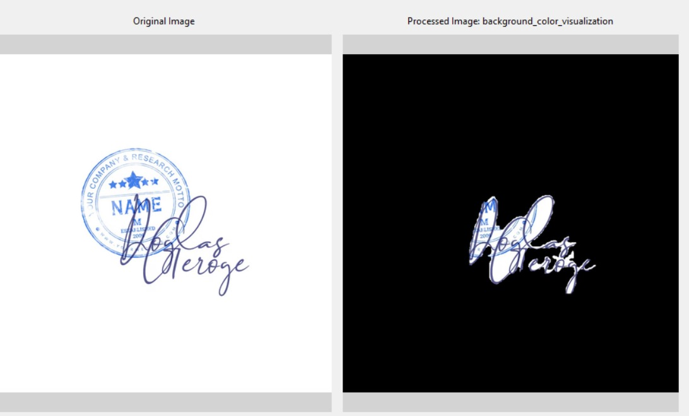

# Stamp and Signature Segmentation

This repository contains a **custom-trained model** that has been integrated into a GUI for easy interaction. The model has been trained using a step-by-step annotation and refinement process to ensure high accuracy.

## Model Information
- **Folder Structure:** The trained model is stored under `final_model/`.
- **GUI File:** `model.py` is the graphical user interface that utilizes the trained model for inference.

## Dataset Preparation
The dataset was constructed through an iterative annotation process:
1. **Original Data:** Raw images were collected and manually annotated using **Roboflow**.
2. **Small Model Training:** An initial lightweight model was trained to assist in further annotation.
3. **Enhanced Data Collection:** Additional **signature images** were incorporated to improve accuracy.
4. **Final Training:** The dataset was refined and used to train the final model deployed in this project.

## Model Performance
The model was trained using **Roboflow 3.0 Instance Segmentation (Fast)** with the **COCO segmentation checkpoint**. Below are its key performance metrics:
- **Mean Average Precision (mAP):** 91.6%
- **Precision:** 91.8%
- **Recall:** 88.5%
  
  

## Model Inference
The GUI application processes images and provides output results in multiple stages:

### Output Images
#### Output 1:


#### Output 2:


#### Output 3:


#### Output 4:


#### Output 4_a:


#### Output 5:


#### Final Output:


## Model Usage
1. Run the GUI using:
   ```bash
   python model.py
   ```
2. Upload an image and let the model process it.
3. View the results in the output directory.


